# Maskan — Real Estate Management & Maintenance System

**Maskan** is a full-featured platform for managing residential real estate. It connects property owners, tenants, and maintenance technicians in one system, covering property listings, bookings, payments, maintenance requests, real-time messaging, notifications, and reviews.

The system is built as a monorepo containing three components:

- **Laravel Web + REST API** — backend and admin dashboard
- **Flutter Mobile Application** — cross-platform mobile app
- **Python FastAPI AI Service** — AI-powered maintenance classification and suggestions

---

## Features

### Authentication & Users
- Email/password registration and login
- OTP-based password reset (email verification)
- Profile management with photo upload
- Account deactivation and deletion
- User roles: admin, owner, tenant, technician
- User ban/unban management

### Real Estate Properties
- Property listing with images and details
- Search, browse, and property details pages
- Owner-managed listings with status control (active/inactive)
- Property approval workflow by admin
- Availability calendar and blackout dates
- City-based configuration

### Bookings & Rentals
- Booking creation and management
- Booking lifecycle: pending, confirmed, cancelled, completed
- Owner dashboard for property bookings

### Payments
- Online payment integration via **Plutu**
- Payment initiation and verification from web and mobile
- Payment history and status tracking

### Maintenance Requests
- Create and track maintenance requests
- Technician assignment and claiming
- Request status workflow
- AI-powered classification of maintenance issues
- AI-generated repair suggestions and feedback

### Communication
- Real-time chat between users (web + mobile) via **Pusher**
- Conversations and message history
- Read receipts and message editing/deletion

### Notifications
- In-app notification center
- Mark as read / mark all as read
- Unread counter
- Push notifications on mobile via local notifications

### Engagement
- Favorites list for properties
- Reviews and ratings
- Complaints and support requests

### Admin Dashboard
- User management (create, edit, ban/unban)
- Property moderation (approve/reject)
- Bookings and maintenance overview
- Reports

### AI Service
- Maintenance request classification (traditional ML + deep learning models)
- Transformer-based NLP (BERT/DistilBERT) support
- Repair suggestion generation
- Redis caching for fast predictions

---

## Technology Stack

| Layer | Technologies |
| ----- | ------------ |
| Backend | PHP 8.2, Laravel 12, MySQL |
| Real-time | Laravel Reverb, Pusher Channels |
| Mobile | Flutter, Dart, flutter_map (OpenStreetMap), geolocator |
| AI Service | Python, FastAPI, scikit-learn, TensorFlow/Keras, Hugging Face Transformers, Redis |
| Payments | Plutu Payment Gateway |
| Web Frontend | Blade, JavaScript, Bootstrap |
| Tools | Git, GitHub, VS Code, Postman |

---

## Getting Started

### Requirements
- PHP 8.2+
- Composer
- Node.js & NPM
- MySQL
- Flutter SDK (for the mobile app)
- Python 3.10+ (for the AI service)

### Backend Setup

```bash
composer install
cp .env.example .env
php artisan key:generate
php artisan migrate --seed
npm install
npm run build
php artisan serve
```

For development with all services (queue, Reverb, scheduler, Vite):

```bash
composer run dev:full
```

### Mobile App

```bash
cd maskan_app/maskan_app
flutter pub get
flutter run
```

### AI Service

```bash
cd maskan-ai
pip install -r requirements.txt
uvicorn app.main:app --reload
```

---

## Security & Rate Limiting

- Authentication required for most endpoints
- Role-based access control for admin routes
- Rate limiting on authentication endpoints to prevent abuse
- OTP throttling for password reset
- User ban check middleware

---

## Screenshots

<div align="center">

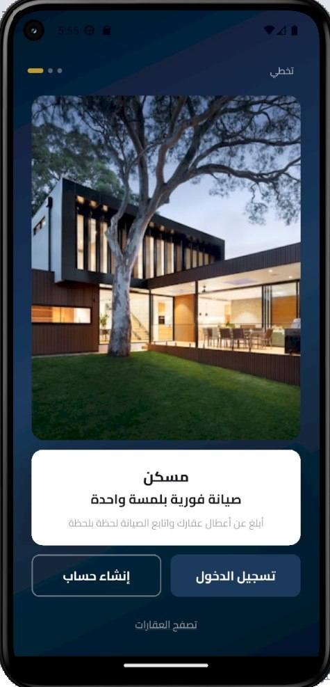
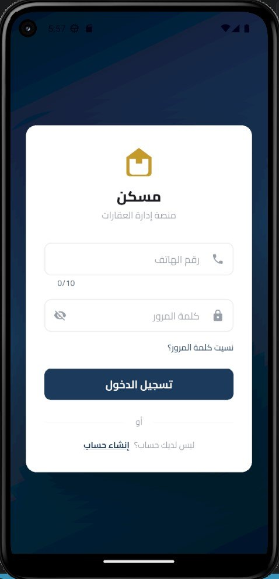
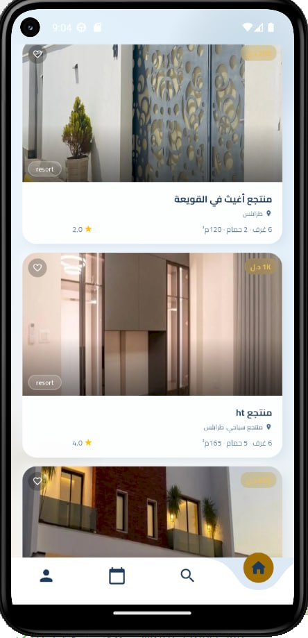

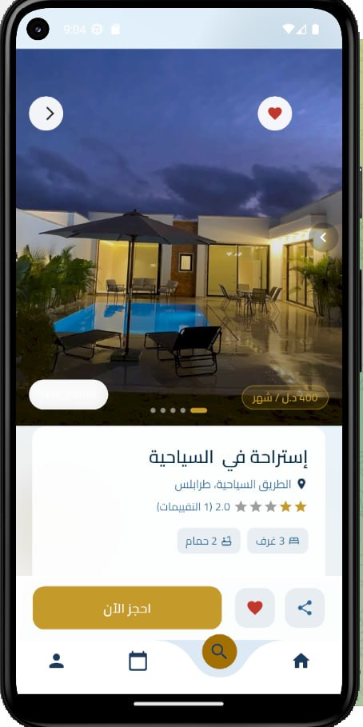
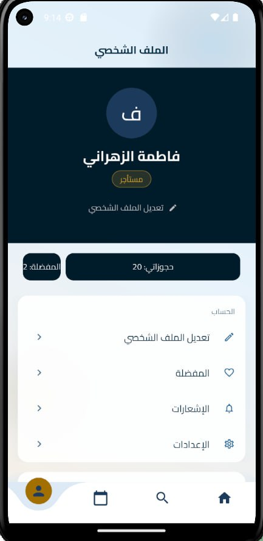

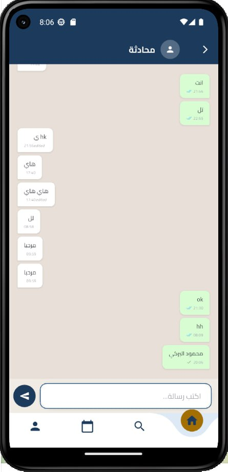
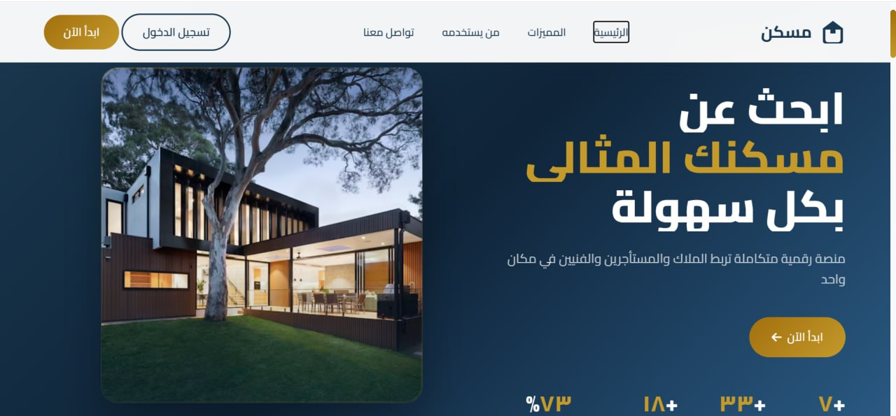
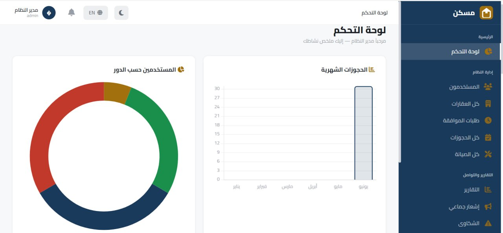

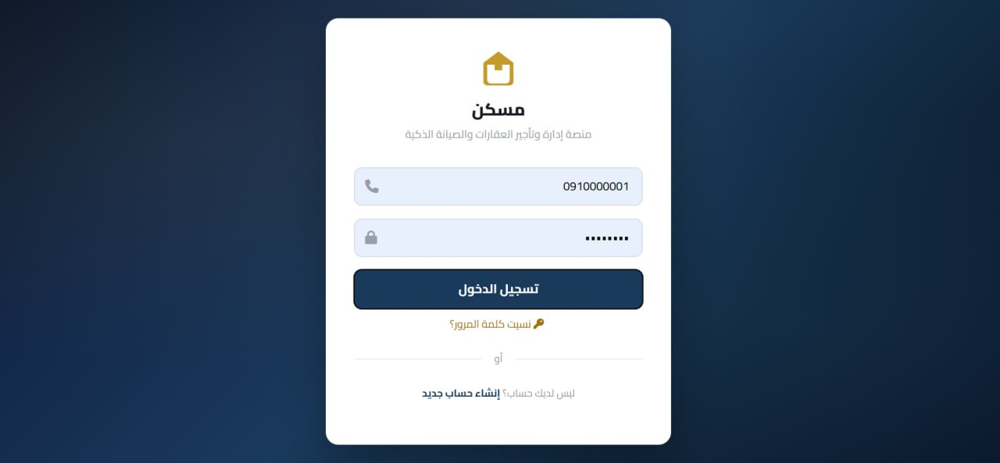
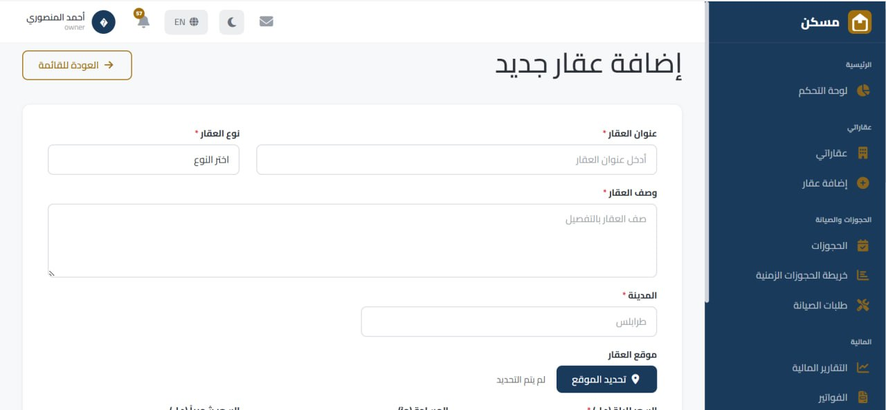
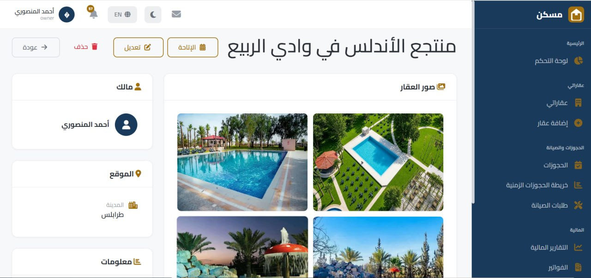

</div>

---

## License

This project is developed for academic and practical purposes. All rights reserved.
